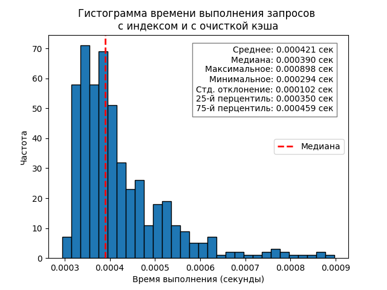
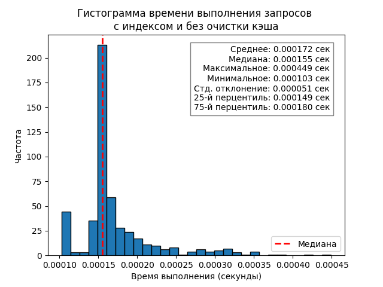
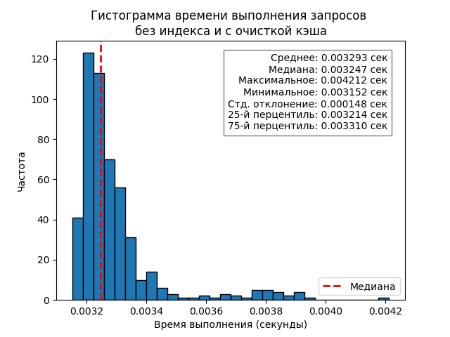
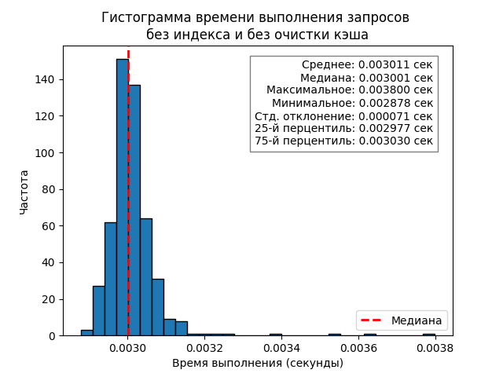
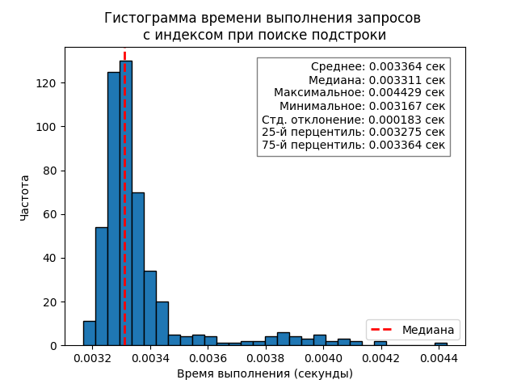
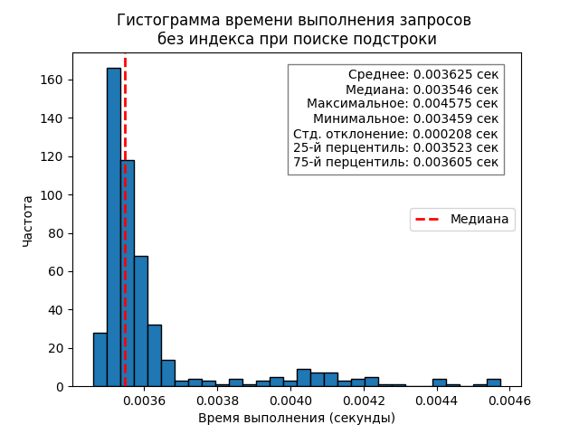

# Отчет о тестировании запросов в MySQL

## Цели тестирования
1. Провести функциональное тестирование: проверить, одинаковые ли результаты получаются при
выполнении запросов вида 
   ```SQL
   SELECT ... FROM <таблица> WHERE <атрибут> LIKE <строка>;
   ```
   с использованием индекса и без него.
2. Провести перфоманс тестирование: сравнить время выполнения запросов такого же вида при выполнении 
с использованием индекса и без него.
3. Найти и показать случай, когда индекс не будет использоваться.

## Подготовка таблиц для проведения тестирования
1. Для проведения функционального тестирования генерируется таблица с атрибутами: id - первичный ключ,
порядковый номер; col1, col2, col3, col4, col5 - атрибуты со случайными строками длиной 5 символов.
Количество строк в таблице - 25.
2. Для проведения перфоманс тестирования была сгенерирована такая же таблица, но с 10000 строками.  
  
Код, использованный для генерации таблиц находится в файлах
fill_table_random.py и fill_table_random_bigdata.py.

## Среда тестирования
- База данных: MySQL
- Библиотеки: pytest, mysql.connector, dotenv, os, matplotlib.pyplot, numpy, time

## Проведение функционального тестирования
- Код, используемый для тестирования, находится в файле test_func_with_and_without_index.py.  
- Запросы, на примере которых мы проверяем одинаковость результатов, находятся в файле sql_query.txt.

### Описание тестов
1. Выполняем запросы из файла sql_query.txt и сохраняем результаты каждого из них в список
no_index_results.
2. Создаём индекс на столбцах col1, col2, col3, col4, col5 таблицы.
3. Снова выполняем запросы из файла и проверяем, совпадают ли результаты с результатами тестов до
создания индекса, сохранёнными в списке no_index_results.
4. Удаляем индекс после выполнения тестов.

### Результаты тестов
Все тесты были успешно пройдены, результаты выполнения запросов и использованием индекса и без
него совпали.

## Проведение перфоманс тестирования

Код для проведения перфоманс тестирования представлен в файлах:

- test_perf_index_clean_cache.py - тестирование с использованием индекса и с очисткой кэша перед
каждой итерацией
- test_perf_index_no_clean_cache.py - тестирование с использованием индекса и без очистки кэша
- test_perf_no_index_clean_cache.py - тестирование без использования индекса и с очисткой кэша 
перед каждой итерацией
- test_perf_no_index_no_clean_cache.py - тестирование без использования индекса и без очистки кэша
- test_perf_index_part.py - тестирование с использованием индекса с поиском подстроки без 
фиксированного префикса
- test_perf_no_index_part.py - тестирование без использования индекса с поиском подстроки без 
фиксированного префикса

В каждом из этих файлов проводится 500 итераций, в каждой из которых: 
1. выполняется запрос при заданных условиях;
2. измеряется время запроса и сохраняется в массиве time_values.

После выполнения всех итераций на основе массива time_values строится гистограмма, которая наглядно
показывает распределение времени выполнения запроса.  
Также на основе массива считаются и выводятся статистики:
- среднее значение;
- медиана;
- максимальное время;
- минимальное время;
- стандартное отклонение;
- 25-й перцентиль;
- 75-й перцентиль.

### Тестирование с использованием индекса и с очисткой кэша

Тестирование проводится на примере запроса 
   ```SQL
   SELECT col1, col2, col3, col4 FROM random_strings_big WHERE col1 LIKE 'ifnyc' 
                                                           AND col2 LIKE 'rucvu' 
                                                           AND col3 LIKE 'votlq' 
                                                           AND col4 LIKE 'vhqik';
   ```
Перед выполнением 500 итераций мы создаём индекс, после выполнения - удаляем. Также перед
каждой итерацией мы очищаем кэш таблицы, чтобы запросы выполнялись не ориентируясь на
информацию из кэша (что меняет время выполнения запроса).

#### Гистограмма


#### Полученные статистики
Среднее время выполнения запроса: 0.000421384334564209 секунд  
Максимальное время выполнения запроса: 0.0008981227874755859 секунд  
Минимальное время выполнения запроса: 0.0002942085266113281 секунд  
Медиана времени выполнения запроса: 0.0003898143768310547 секунд  
Стандартное отклонение времени выполнения запроса: 0.00010190542192337258 секунд  
25-й перцентиль времени выполнения запроса: 0.0003501772880554199 секунд  
75-й перцентиль времени выполнения запроса: 0.00045943260192871094 секунд  

### Тестирование с использованием индекса и без очистки кэша
Тестирование проводится на примере того же запроса, что и в предыдущем варианте, но здесь
мы не очищаем кэш перед каждой итерацией.

#### Гистограмма


#### Полученные статистики
Среднее время выполнения запроса: 0.0001720566749572754 секунд  
Максимальное время выполнения запроса: 0.0004494190216064453 секунд  
Минимальное время выполнения запроса: 0.00010251998901367188 секунд  
Медиана времени выполнения запроса: 0.0001552104949951172 секунд  
Стандартное отклонение времени выполнения запроса: 5.126195118518582e-05 секунд  
25-й перцентиль времени выполнения запроса: 0.0001494884490966797 секунд  
75-й перцентиль времени выполнения запроса: 0.00017970800399780273 секунд  
  
Можно отметить, что при отсутствии очистки кэша время выполнения запроса уменьшилось
в среднем в 2.45 раз.

### Тестирование без использования индекса и с очисткой кэша

Тестирование проводится на примере того же запроса при том, что индекс не создаётся и кэш
очищается перед каждой итерацией.

#### Гистограмма


#### Полученные статистики
Среднее время выполнения запроса: 0.0032927331924438477 секунд  
Максимальное время выполнения запроса: 0.004212141036987305 секунд  
Минимальное время выполнения запроса: 0.0031516551971435547 секунд  
Медиана времени выполнения запроса: 0.0032466650009155273 секунд  
Стандартное отклонение времени выполнения запроса: 0.00014844643256991304 секунд  
25-й перцентиль времени выполнения запроса: 0.0032137036323547363 секунд  
75-й перцентиль времени выполнения запроса: 0.003310263156890869 секунд  

Можно отметить, что при отсутствии индекса время выполнения запроса увеличилось
в среднем в 7.82 раз по сравнению с тестами при таких же условиях, но с индексом.

### Тестирование без использования индекса и без очистки кэша

Тестирование проводится на примере того же запроса при том, что индекс не создаётся и кэш не
очищается.

#### Гистограмма


#### Полученные статистики
Среднее время выполнения запроса: 0.0030108280181884764 секунд  
Максимальное время выполнения запроса: 0.0037996768951416016 секунд  
Минимальное время выполнения запроса: 0.0028777122497558594 секунд  
Медиана времени выполнения запроса: 0.0030014514923095703 секунд  
Стандартное отклонение времени выполнения запроса: 7.136878966418593e-05 секунд  
25-й перцентиль времени выполнения запроса: 0.002976536750793457 секунд  
75-й перцентиль времени выполнения запроса: 0.003030061721801758 секунд  
  
Можно отметить, что при отсутствии индекса время выполнения запроса увеличилось
в среднем в 17.5 раз по сравнению с тестами при таких же условиях, но с индексом.  
Также по сравнению с выполнением запроса с очисткой кэша время уменьшилось, но не
так значительно.

### Тестирование с использованием индекса с поиском подстроки без фиксированного префикса

Тестирование выполнялось на примере запроса
   ```SQL
   SELECT col1, col2, col3, col4 FROM random_strings_big WHERE col1 LIKE '%ny%' 
                                                           AND col2 LIKE '%cv%' 
                                                           AND col3 LIKE '%ot%' 
                                                           AND col4 LIKE '%hq%';
   ```

Тестирование проводилось с очисткой кэша, поскольку так результаты получаются более показательными.  

#### Гистограмма


#### Полученные статистики
Среднее время выполнения запроса: 0.0033639774322509765 секунд  
Максимальное время выполнения запроса: 0.004429340362548828 секунд  
Минимальное время выполнения запроса: 0.003166675567626953 секунд  
Медиана времени выполнения запроса: 0.0033111572265625 секунд  
Стандартное отклонение времени выполнения запроса: 0.00018256006685326727 секунд  
25-й перцентиль времени выполнения запроса: 0.0032753944396972656 секунд  
75-й перцентиль времени выполнения запроса: 0.0033641457557678223 секунд  

### Тестирование без использования индекса с поиском подстроки без фиксированного префикса

Тестирование проводилось на примере того же запроса, но без использования индекса.

#### Гистограмма


#### Полученные статистики
Среднее время выполнения запроса: 0.003625389099121094 секунд  
Максимальное время выполнения запроса: 0.004575490951538086 секунд  
Минимальное время выполнения запроса: 0.0034589767456054688 секунд  
Медиана времени выполнения запроса: 0.00354611873626709 секунд  
Стандартное отклонение времени выполнения запроса: 0.0002076293368700822 секунд  
25-й перцентиль времени выполнения запроса: 0.003522515296936035 секунд  
75-й перцентиль времени выполнения запроса: 0.003604710102081299 секунд  
  
Можно отметить, что при отсутствии индекса время выполнения запроса в среднем почти не
изменилось, значит, можно прийти к выводу, что при поиске подстроки без фиксированного
префикса индекс не работает.

## Результаты всех тестов

По результатам тестирования можно прийти к выводам:

- Результаты выполнения запроса с использованием индекса и без него совпадают.
- При поиске строки с фиксированным префиксом использование индекса ускоряет поиск
примерно в 8 раз.
- При использовании индекса и без очистки кэша скорость выполнения запроса уменьшается 
примерно в 2.5 раза.
- При поиске подстроки без фиксированного префикса индекс не работает.
